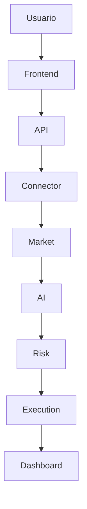
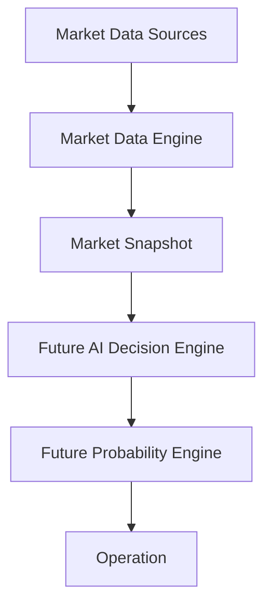
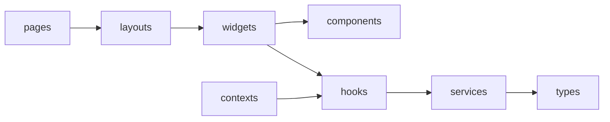
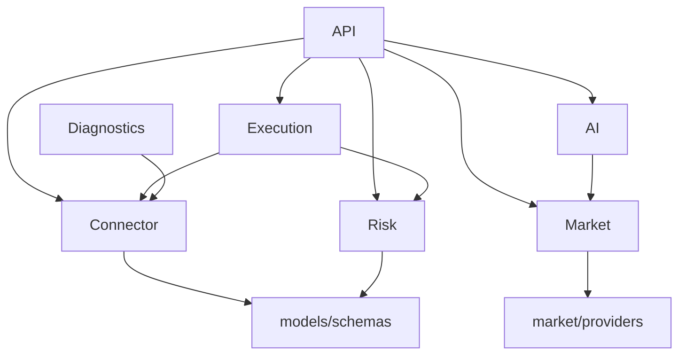

# Friday AI Platform Architecture

## Visao geral

Friday AI Platform e uma plataforma modular de IA. O trading permanece como modulo historico e experimental, mas a arquitetura passa a ser centrada em Core, Modules, Shared Contracts e providers isolados. O objetivo arquitetural nao e criar apenas um robo, mas uma base modular para crescer por anos com engines, providers, diagnosticos, frontend e futuras experiencias Vision-First.

O sistema deve evoluir com mentalidade de Software House: documentacao clara, contratos estaveis, baixo acoplamento, alta coesao, seguranca desde a origem e sprints pequenas com criterio tecnico.

## Principios

- Clean Code: nomes explicitos, modulos pequenos, responsabilidades claras e efeitos colaterais controlados.
- SOLID: dependencias devem apontar para contratos e fronteiras, nao para detalhes volateis.
- Arquitetura modular: cada dominio possui responsabilidade propria e nao invade outros dominios.
- Baixo acoplamento: um modulo nao deve conhecer a implementacao interna de outro.
- Alta coesao: codigo relacionado ao mesmo motivo de mudanca deve viver junto.
- Escalabilidade: novos providers, conectores, estrategias e telas devem entrar por extensao, nao por reescrita.
- Seguranca: tokens, cookies, bearer, authorization, refresh tokens, SSID, `.env`, HAR e caches privados nunca devem ser expostos ou versionados.

## Arquitetura oficial

```text
app/
  api/
  connector/
    polarium/
      oauth/
      session/
      websocket/
      parser/
      execution/
      diagnostics/
  market/
    data/
    providers/
    scanner/
    candles/
    ticks/
    assets/
  ai/
  risk/
  execution/
  services/
  models/
  schemas/
  utils/
  config/

frontend/
  pages/
  components/
  hooks/
  market-data/
  services/
  contexts/
  types/
  layouts/
  widgets/
```

Esta documentacao preserva a arquitetura historica do dominio de mercado. A arquitetura nova e oficial da plataforma esta em `docs/FRIDAY_ARCHITECTURE.md`. As proximas sprints devem mover fronteiras de forma incremental, sem quebrar APIs e sem alterar comportamento sem necessidade.

### Fronteira Polarium implementada na Sprint 3

```text
app/connector/polarium/
  oauth/          OAuth, PKCE e token/session lab.
  session/        Login seguro, cache de sessao e estado da conta.
  websocket/      Gravacao e analise tecnica de frames WebSocket.
  parser/         Parsers de payloads Polarium normalizados.
  execution/      Fronteira reservada para transporte de execucao futura.
  diagnostics/    Laboratorios e inspecoes tecnicas isoladas do fluxo operacional.
```

Os modulos antigos em `app/services/polarium_*` devem permanecer apenas como compatibilidade temporaria. Novos imports internos devem preferir `app.connector.polarium.*`.

## Fluxo operacional



O fluxo acima define a direcao permitida de dependencias operacionais. Dependencias inversas devem ser evitadas.

## Responsabilidades de backend

### API

Camada HTTP/WebSocket publica do backend. Deve validar entrada, chamar casos de uso ou servicos de aplicacao e devolver contratos estaveis. Nao deve conter regra pesada de negocio.

### Connector

Responsavel por integrar com corretoras e plataformas externas. No caso Polarium:

- OAuth
- PKCE
- Login
- Sessao
- WebSocket
- Parser
- Diagnostics tecnicos do conector

O Connector nunca executa IA, nunca decide trade e nunca calcula risco. Ele apenas autentica, conecta, normaliza e entrega dados/eventos autorizados para camadas acima.

### Market

Responsavel pela representacao de mercado:

- market data engine
- candles
- ticks
- assets
- historico
- providers

Market normaliza dados para que AI, Risk e Execution nao dependam diretamente de uma corretora ou provider especifico.

### Market Data Engine

O Market Data Engine e a fonte unica de contexto de mercado para o frontend e para futuras camadas de decisao. Ele organiza ativo, timeframe, broker, ambiente, conta, moeda, disponibilidade, fonte dos dados e ultima atualizacao sem criar indicadores, sinais, IA ou estados ficticios.



Nenhum modulo novo deve consumir providers diretamente quando precisar de contexto de mercado. A leitura deve passar por contratos do Market Data Engine ou por APIs ja normalizadas pelo dominio Market.

### AI

Responsavel por:

- score
- analise
- ranking
- decisao

AI consome dados normalizados do Market e produz interpretacoes explicaveis. AI nao autentica conector, nao executa ordens e nao ignora Risk.

### Risk

Responsavel por:

- gerenciamento da banca
- regras operacionais
- AutoTrade Gate

Risk e a camada de protecao antes de qualquer execucao. Nenhuma decisao de AI deve liberar operacao sem passar pelo Risk.

### Execution

Responsavel por:

- ordens
- replay
- demo

Execution deve receber comandos ja validados por AI e Risk. Em desenvolvimento, execucao real permanece bloqueada e o modo DEMO/DRY_RUN e a regra.

### Diagnostics

Responsavel por:

- logs
- laboratorios
- gravacao WS
- sniffers

Diagnostics nunca participa do fluxo operacional de trading. Ele observa, coleta evidencias e auxilia investigacao, mas nao libera sinal, risco ou ordem.

## Responsabilidades de frontend

- Dashboard: composicao principal da experiencia operacional.
- Market Data: fonte compartilhada de ativo, timeframe, broker e ambiente.
- Scanner: lista e ranking de oportunidades.
- Chart: graficos de candles, preco, timeframe e contexto visual.
- Orders: visualizacao de ordens, simulacoes e estado de execucao.
- HUD: estado compacto de conta, conexao, gate, latencia e modo.
- Replay: reproducao de eventos ou cenarios historicos.
- Settings: preferencias operacionais e configuracoes seguras.
- Assets: catalogo, status e detalhes dos ativos.
- Balance: saldo, moeda, minimo de entrada e sincronizacao.
- AI: score, confianca, razoes e alertas explicaveis.
- Logs: eventos tecnicos e operacionais sem expor segredos.



## Dependencias permitidas



Regras:

- API pode orquestrar dominios, mas nao deve concentrar regra de negocio.
- Connector pode depender de contratos, configuracao e utilitarios, mas nao de AI, Risk ou Execution.
- Market pode depender de providers e contratos, mas nao de AI.
- AI pode consumir Market, mas nao pode chamar Connector diretamente.
- Risk pode consumir contratos e estado normalizado, mas nao pode chamar Connector diretamente.
- Execution depende de aprovacoes e contratos; nunca deve contornar Risk.
- Diagnostics pode observar Connector e Market, mas nunca deve ser dependencia obrigatoria do fluxo operacional.

## Seguranca

- Nunca versionar `.env`, HAR, tokens, cookies, bearer, authorization, refresh tokens, SSID, credenciais ou `.jarvis_cache`.
- Nunca exibir tokens brutos no frontend.
- Nunca executar ordem real automaticamente.
- Conta REAL permanece bloqueada durante desenvolvimento.
- Qualquer integracao futura com Polarium deve usar sessao propria/autorizada e manter DEMO como primeira camada de validacao.

## Estado atual e evolucao

A base atual ja possui FastAPI, React/Vite, modelos Pydantic, providers simulados, modulos Polarium de laboratorio, AI Decision, Risk Manager, AutoTrade Gate e Execution DEMO. A evolucao arquitetural deve consolidar esses blocos na estrutura oficial sem mudancas bruscas.

As proximas sprints devem priorizar fronteiras, documentacao, testes e migracoes pequenas.
