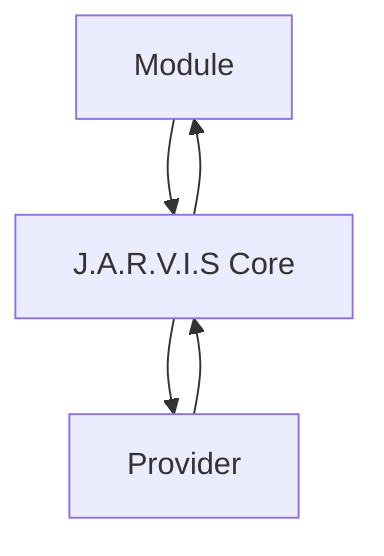

# Friday AI Platform Architecture

## Vision

Friday AI Platform is a modular AI platform prepared for long-term expansion across
multiple product domains. Trading becomes one module in a broader architecture rather
than the center of the system.

The platform is organized around J.A.R.V.I.S Core, a neutral orchestration layer that
keeps product modules isolated from providers, model vendors, and future external
integrations.

## Objectives

- Keep modules independent from provider implementations.
- Allow multiple AI, data, and automation providers through stable contracts.
- Preserve compatibility with the existing FastAPI and React application.
- Avoid runtime side effects in architecture-only packages.
- Keep future Vision, Chat, RAG, OCR, and automation work behind explicit engine
  boundaries.

## Project Structure

```text
core/
  orchestrator/
  identity/
  prompts/
  memory/
  vision/
  decision/
  risk/
  context/
  learning/
  analytics/
  audit/
  providers/

modules/
  trading/
  finance/
  marketing/
  seo/
  documents/
  automation/
  sites/
  crm/

shared/
  contracts.py
  interfaces.py

sdk/
  base.py
  contracts.py
  manifest.py
  registry.py
  loader.py
  models.py
  metadata.py
  validators.py
  exceptions.py
  config.py
```

## Official Engines

- Core Orchestrator: single entry point that coordinates Core execution.
- Identity Engine: identity, personality, behavior, and product tone.
- Prompt Engine: prompt construction, context policy, token policy, and global
  instructions.
- Vision Engine: image and screenshot analysis contracts for future work.
- Memory Engine: history, preferences, context, and cache contracts.
- Decision Engine: structured AI output validation and final decision contracts.
- Risk Engine: risk, confidence, limits, and scoring contracts.
- Context Engine: user, module, session, and execution context normalization.
- Learning Engine: future feedback and learning boundaries.
- Analytics Engine: metrics, dashboards, and product intelligence contracts.
- Audit Engine: logs, traceability, and compliance-oriented audit contracts.
- Provider Engine: neutral abstraction for OpenAI and future providers.

## First Functional Core Engine

The first functional J.A.R.V.I.S Core engine is the Prompt Engine.

```text
Module
  -> PromptRequest
  -> PromptEngine
  -> PromptPackage
  -> Core Provider Layer
```

The Prompt Engine owns prompt construction, validation, template lookup,
versioning, sanitization, size estimation, metadata, and deterministic fingerprints.
It never calls providers directly and never performs network IO.

## Second Functional Core Engine

The second functional J.A.R.V.I.S Core engine is the Identity Engine.

```text
Module
  -> IdentityRequest
  -> IdentityEngine
  -> IdentityProfile
  -> PromptEngine
  -> PromptPackage
  -> Core Provider Layer
```

The Identity Engine owns identity selection, profile loading, versioning, validation,
metadata, and deterministic fingerprints. It never builds prompt messages, never calls
providers, never imports Vision, Memory, or Prompt Engine, and never performs network IO.

## Third Functional Core Engine

The third functional J.A.R.V.I.S Core engine is the Provider Engine.

```text
Module
  -> IdentityEngine
  -> PromptEngine
  -> ProviderEngine
  -> AIProvider
  -> Response
```

The Provider Engine owns provider selection, factory/registry orchestration,
capability validation, health contracts, retry policy, fallback policy, response
normalization, metadata, and provider observability. V1.0 includes only local
placeholders for OpenAI, Anthropic, Google, Groq, Ollama, and LM Studio. No external
API is connected in this sprint.

## Core Orchestrator Entry Point

The Core Orchestrator is the official single entry point for complete Core execution.

```text
Module
  -> CoreOrchestrator
  -> IdentityEngine
  -> PromptEngine
  -> ProviderEngine
  -> AIProvider
  -> ExecutionResponse
```

It owns execution context, pipeline stages, hooks, internal events, metadata,
validation, response normalization, and final execution response. It does not create
business rules, interpret images, access memory, persist data, or call external APIs
directly.

## Developer Console

The official development environment for validating the Core flow is the Friday Core
Demo at `/developer/core-demo`.

```text
Frontend
  -> DemoService
  -> CoreOrchestrator
  -> IdentityEngine
  -> PromptEngine
  -> ProviderEngine
  -> MockProvider
  -> ExecutionResponse
```

The console is limited to the Mock Provider and consumes only the public
`ExecutionResponse` contract.

## Dependency Rule

Modules must never communicate directly with providers.



Direct module-to-provider dependencies are forbidden:

```text
Module -> Provider  # forbidden
```

## Module SDK

The Module SDK is the official boundary between product modules and J.A.R.V.I.S Core.

```text
Module
  -> Module SDK
  -> CoreOrchestrator
  -> IdentityEngine
  -> PromptEngine
  -> ProviderEngine
  -> ExecutionResponse
```

Modules must use SDK contracts such as `ModuleManifest`, `ModuleRequest`,
`ModuleResponse`, `ModuleRegistry`, and `ModuleLoader`. Product modules must not import
Core engines directly.

## Business Modules

Business modules represent product domains on top of the Module SDK. The first
official business module is the Trading Module.

```text
Trading Module
  -> Module SDK
  -> CoreOrchestrator
  -> MockProvider
  -> TradingResponse
```

Trading Module V1.0 is read-only and mock-only. It does not connect to brokers,
external APIs, real providers, streaming, memory, or automated execution.

## Release Candidate 1

Sprint 007.1 hardens the Developer Console as a validation UI only. It adds the
J.A.R.V.I.S Trading Report, final pipeline `SUCCESS`, in-memory execution history,
status cards, execution counter, latency classification, and responsive polish.

This RC1 layer does not change Core, SDK, Orchestrator, Identity, Prompt, Provider
Engine, or Trading Module behavior.

## Provider Foundation

The provider foundation currently contains base contracts and placeholders only:

- Provider interface
- Base provider
- Mock provider
- OpenAI provider placeholder
- Provider factory
- Provider Engine

The OpenAI provider placeholder does not call the OpenAI API. External integrations
must be introduced only in future feature sprints with explicit configuration,
security review, and tests.

## Provider Plugin System

Sprint 008 promotes the Provider Engine to a plugin system:

```text
ProviderEngine
  -> ProviderLoader
  -> ProviderRegistry
  -> Selected Provider Plugin
  -> ProviderResponse
```

Every provider must expose `ProviderManifest`, `ProviderMetadata`, health,
capabilities, lifecycle methods, and a `ProviderResponse`. The Mock Provider is the
only functional provider in this sprint and continues to call no external API.

## Provider Configuration Layer

Sprint 008.5 adds the official Provider Configuration System:

```text
Core Orchestrator
  -> Provider Engine
  -> Provider Resolver
  -> Provider Configuration
  -> Provider Registry
  -> Selected Provider
```

`ProviderConfiguration` centralizes default provider, enabled providers, provider
priority, fallback, health checks, debug mode, and environment metadata.
`FeatureFlags` keeps Mock enabled and all real providers disabled by default.
`ProviderResolver` selects the active provider through the configuration and
registry instead of hardcoded engine logic. `ProviderHealthManager` exposes
sanitized health fields for the Developer Console.

Mock remains the operational default provider. No real provider is implemented or
called by this layer.

## Compatibility

Existing backend, frontend, market, vision, and archived broker research code remain
in place for compatibility. This sprint only adds the architectural foundation for
Friday AI Platform and updates appropriate product naming.

## Roadmap

1. Stabilize the platform Core and module contracts.
2. Move product capabilities behind module boundaries.
3. Introduce Vision analysis through the Vision Engine.
4. Add provider implementations through the Provider Engine only.
5. Add memory, analytics, and audit persistence behind explicit contracts.
6. Expand modules without direct provider coupling.

## Conventions

- Keep architecture-only packages free of network IO.
- Keep provider-specific code behind provider contracts.
- Keep shared contracts small and stable.
- Do not store or log secrets, tokens, cookies, HAR files, images, or raw external
  payloads in platform contracts.
