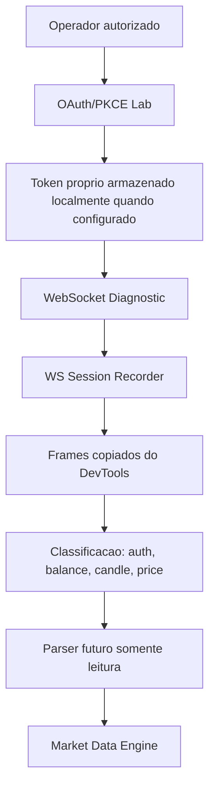

# Real Market Data Discovery

## Objetivo

Documentar evidencias atuais para futura obtencao de dados reais de mercado da Polarium em sessao autorizada.

Esta investigacao nao implementa IA, indicadores, Probability Engine, AutoTrade, execucao, novos endpoints ou conexoes automaticas. Tambem nao altera o runtime do frontend, backend, Connector em producao ou Providers.

## Escopo e Fontes

Fontes analisadas dentro do repositorio:

- `app/connector/polarium/oauth/lab.py`
- `app/connector/polarium/diagnostics/service.py`
- `app/connector/polarium/websocket/recorder.py`
- `app/connector/polarium/session/connector.py`
- `app/connector/polarium/parser/live_balance.py`
- `app/api/routes/polarium*.py`
- `app/api/routes/market.py`
- `app/models/candle.py`
- `app/models/market_asset.py`
- `app/models/polarium_ws_recorder.py`
- `tests/test_polarium_live_balance_parser.py`
- `tests/test_polarium_ws_recorder.py`
- `docs/V0_19_0_LIVE_ACCOUNT_SYNC_BRIDGE.md`
- `docs/V0_22_0_POLARIUM_CONNECTION_DIAGNOSTIC_LAB.md`
- `docs/V0_24_0_POLARIUM_WS_SESSION_RECORDER.md`

Arquivos sensiveis, `.env`, cookies, tokens, HAR bruto, credenciais e `.jarvis_cache` nao foram lidos.

## Fluxo Encontrado



O fluxo seguro atual e de laboratorio. Ele prepara OAuth/PKCE proprio, testa handshake WebSocket e permite analisar frames copiados pelo operador. Nao ha conector automatico de candles reais em producao.

## Endpoints Observados

Endpoints internos existentes no Friday Trade:

- `GET /api/v1/polarium/oauth/config`
- `POST /api/v1/polarium/oauth/start`
- `GET /api/v1/polarium/oauth/callback`
- `POST /api/v1/polarium/oauth/exchange`
- `GET /api/v1/polarium/oauth/session`
- `POST /api/v1/polarium/oauth/logout`
- `GET /api/v1/polarium/diagnostics/summary`
- `GET /api/v1/polarium/diagnostics/oauth`
- `POST /api/v1/polarium/diagnostics/websocket`
- `POST /api/v1/polarium/diagnostics/stream`
- `POST /api/v1/polarium/ws-recorder/analyze`
- `GET /api/v1/polarium/ws-recorder/snippet`
- `GET /api/v1/polarium/status`
- `POST /api/v1/polarium/sync`
- `POST /api/v1/polarium/debug/ws-message`
- `GET /api/v1/polarium/account/state`
- `GET /api/v1/market/assets`
- `GET /api/v1/market/candles`
- `GET /api/v1/market/snapshot`

Endpoints externos mapeados em codigo para OAuth/PKCE:

- `https://api.trade.polariumbroker.com/auth/oauth.v5/authorize`
- `https://api.trade.polariumbroker.com/auth/oauth.v5/token`

Observacao: os endpoints externos acima aparecem como defaults no laboratorio OAuth. A presenca deles no codigo nao prova, sozinha, permissao operacional nem acesso a dados de mercado.

## Mensagens WebSocket Observadas ou Detectaveis

Eventos reais ou candidatos ja mapeados pelo laboratorio:

- `marginal-balance`
- `balances`
- `subscription-balance-changed`
- `candle-generated`
- `digital-option-client-price-generated`
- `portfolio.get-history-positions`

Evidencia forte:

- `marginal-balance` possui teste com payload completo e parser validado em `tests/test_polarium_live_balance_parser.py`.
- `subscription-balance-changed` possui teste e e tratado como evento parcial/cache-only.

Evidencia de classificacao, ainda nao de contrato real final:

- `candle-generated` e `digital-option-client-price-generated` sao detectados por `PolariumWsRecorderService`.
- O teste `tests/test_polarium_ws_recorder.py` usa payload sintetico de laboratorio para validar a classificacao de frames. Ele nao prova payload real completo de candles da Polarium.

## Estrutura dos Payloads

### Balance

Payload validado por teste:

```json
{
  "request_id": "10",
  "name": "marginal-balance",
  "msg": {
    "id": 1241028586,
    "user_id": 191243694,
    "available": "16037.53",
    "cash": "16037.53",
    "equity": "16037.53",
    "equity_usd": "16037.53",
    "currency": "USD",
    "type": 4
  },
  "status": 2000
}
```

Campos identificados:

- `request_id`
- `name`
- `status`
- `msg.id`
- `msg.user_id`
- `msg.available`
- `msg.cash`
- `msg.equity`
- `msg.equity_usd`
- `msg.currency`
- `msg.type`

### Candle

Evento candidato:

```text
candle-generated
```

Campos candidatos usados apenas em teste de classificador:

```json
{
  "name": "candle-generated",
  "microserviceName": "quotes",
  "msg": {
    "active_id": 1,
    "open": 1,
    "close": 2
  }
}
```

Estado da evidencia:

- Existe evento candidato de candle.
- Existe deteccao de `active_id`, `name`, `microserviceName`, `request_id` e chaves de `msg`.
- Ainda nao existe evidencia persistida no repositorio de payload real completo com `open`, `high`, `low`, `close`, `timestamp`, `symbol` e `timeframe`.

### Price

Evento candidato:

```text
digital-option-client-price-generated
```

Campos candidatos usados apenas em teste de classificador:

```json
{
  "name": "digital-option-client-price-generated",
  "microserviceName": "trading-settings",
  "msg": {
    "active_id": 1,
    "price": 86
  }
}
```

Estado da evidencia:

- Existe evento candidato de preco/payout.
- Ainda nao ha contrato real final para associar esse evento a OHLC.

## Eventos, Heartbeat e Reconnect

Eventos de dados candidatos:

- Balance: `marginal-balance`, `balances`, `subscription-balance-changed`
- Candle: `candle-generated`
- Price/Payout: `digital-option-client-price-generated`

Heartbeat:

- O diagnostico WebSocket pode enviar probe `{"name": "timeSync"}` quando configurado.
- Ainda nao ha evidencia suficiente de heartbeat oficial da Polarium no repositorio.

Reconnect:

- O snippet do WS Session Recorder captura `open`, `close`, `code` e `reason`.
- Ainda nao ha politica de reconnect real documentada para Polarium.

## Confirmacoes Tecnicas

| Item | Status | Evidencia |
| --- | --- | --- |
| Ativos | Parcial | `GET /api/v1/market/assets` existe, mas atualmente depende do Provider Manager e pode retornar dado simulado. |
| Candles | Nao confirmado | Evento candidato `candle-generated` existe no recorder, mas payload real completo nao esta persistido. |
| OHLC | Nao confirmado | `app/models/candle.py` define contrato OHLC interno, mas nao prova OHLC real Polarium. |
| Timestamp | Nao confirmado | Candle interno exige `timestamp`; payload real Polarium ainda nao comprovado. |
| Timeframe | Nao confirmado | Timeframe existe no contrato interno; mapeamento Polarium real ainda precisa ser observado. |
| Atualizacoes | Parcial | WS recorder detecta frames e eventos candidatos; stream real de candles ainda precisa de captura autorizada. |
| Snapshot | Nao confirmado | `/market/snapshot` existe para provider atual, mas nao e prova de snapshot real Polarium. |
| Historico | Nao confirmado | `portfolio.get-history-positions` e conhecido como evento/chave, mas nao e historico OHLC. |

## Contrato Interno de Candle

Contrato criado em `app/market/adapters/market_data_adapter.py`:

```python
@dataclass(frozen=True)
class MarketDataCandle:
    symbol: str
    timeframe: Timeframe
    open: float
    high: float
    low: float
    close: float
    timestamp: datetime
    source: MarketDataSource
    confirmed: bool
```

Regras do contrato:

- `symbol`: simbolo normalizado conhecido.
- `timeframe`: timeframe interno suportado.
- `open`, `high`, `low`, `close`: valores vindos de payload observado.
- `timestamp`: horario real do provider ou horario comprovadamente associado ao candle.
- `source`: origem observada.
- `confirmed`: `True` somente quando o candle vier de payload real completo e validado.

O contrato nao gera candles, nao abre conexoes, nao importa provider concreto e nao altera rotas existentes.

## Limitacoes

- Nao ha captura real persistida de frames Polarium com candle OHLC completo.
- Nao ha mapeamento comprovado `active_id -> symbol` para candles reais.
- Nao ha mapeamento comprovado de timeframe real da Polarium para `M1/M5/M15`.
- Nao ha payload real persistido com timestamp de candle.
- Nao ha sequencia oficial observada de subscribe para candles.
- Nao ha contrato de heartbeat/reconnect definitivo.
- O ambiente atual possui Market Reader e Live Market com dados simulados; esses modulos nao devem ser tratados como prova de mercado real.

## Hipoteses

Hipoteses ainda pendentes de validacao:

- O browser autorizado envia mensagens de subscribe apos abrir o WebSocket.
- `candle-generated` pode conter OHLC completo em frames reais.
- `digital-option-client-price-generated` pode ser util para payout/preco, mas nao substitui candle OHLC.
- `active_id` precisara ser mapeado para simbolo negociavel por payload adicional ou catalogo da sessao.

## Proximos Passos

1. Abrir sessao Polarium autorizada pelo operador.
2. Ativar o WS Session Recorder snippet somente na sessao do operador.
3. Recarregar a pagina Polarium e capturar os primeiros frames apos handshake.
4. Copiar frames sanitizados para `POST /api/v1/polarium/ws-recorder/analyze`.
5. Confirmar se aparecem auth candidates, subscriptions, candles e prices.
6. Capturar pelo menos um frame `candle-generated` completo.
7. Documentar chaves reais de OHLC, timestamp, active id, symbol e timeframe.
8. Criar parser somente leitura para converter payload real em `MarketDataCandle`.
9. Integrar parser ao Market Data Engine somente depois de evidencias suficientes.

## Resultado da Sprint

Ainda nao podemos afirmar que conseguimos obter candles reais, OHLC, timestamps, timeframe ou historico da Polarium.

Podemos afirmar:

- O fluxo OAuth/PKCE proprio esta preparado em laboratorio.
- Existe diagnostico WebSocket interno.
- Existe recorder para frames reais copiados do DevTools.
- Existe parser validado para saldo real via `marginal-balance`.
- Existem detectores para eventos candidatos de candle e preco.
- Existe agora contrato interno passivo para Candle real futuro.

Bloqueio atual:

- Falta captura autorizada de frames reais contendo candle OHLC completo e sua sequencia de subscription.
