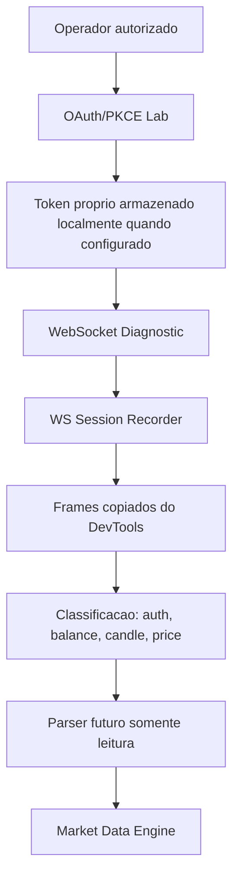

# Real Market Data Discovery

## Objetivo

Documentar evidencias atuais para futura obtencao de dados reais de mercado da Polarium em sessao autorizada.

Esta investigacao nao implementa IA, indicadores, Probability Engine, AutoTrade, execucao, novos endpoints ou conexoes automaticas. Tambem nao altera o runtime do frontend, backend, Connector em producao ou Providers.

## Escopo e Fontes

Fontes analisadas dentro do repositorio:

- `app/connector/polarium/oauth/lab.py`
- `app/connector/polarium/diagnostics/service.py`
- `app/connector/polarium/websocket/recorder.py`
- `app/connector/polarium/session/connector.py`
- `app/connector/polarium/parser/live_balance.py`
- `app/api/routes/polarium*.py`
- `app/api/routes/market.py`
- `app/models/candle.py`
- `app/models/market_asset.py`
- `app/models/polarium_ws_recorder.py`
- `tests/test_polarium_live_balance_parser.py`
- `tests/test_polarium_ws_recorder.py`
- `docs/V0_19_0_LIVE_ACCOUNT_SYNC_BRIDGE.md`
- `docs/V0_22_0_POLARIUM_CONNECTION_DIAGNOSTIC_LAB.md`
- `docs/V0_24_0_POLARIUM_WS_SESSION_RECORDER.md`

Arquivos sensiveis, `.env`, cookies, tokens, HAR bruto, credenciais e `.jarvis_cache` nao foram lidos.

## Fluxo Encontrado



O fluxo seguro atual e de laboratorio. Ele prepara OAuth/PKCE proprio, testa handshake WebSocket e permite analisar frames copiados pelo operador. Nao ha conector automatico de candles reais em producao.

## Endpoints Observados

Endpoints internos existentes no Friday Trade:

- `GET /api/v1/polarium/oauth/config`
- `POST /api/v1/polarium/oauth/start`
- `GET /api/v1/polarium/oauth/callback`
- `POST /api/v1/polarium/oauth/exchange`
- `GET /api/v1/polarium/oauth/session`
- `POST /api/v1/polarium/oauth/logout`
- `GET /api/v1/polarium/diagnostics/summary`
- `GET /api/v1/polarium/diagnostics/oauth`
- `POST /api/v1/polarium/diagnostics/websocket`
- `POST /api/v1/polarium/diagnostics/stream`
- `POST /api/v1/polarium/ws-recorder/analyze`
- `GET /api/v1/polarium/ws-recorder/snippet`
- `GET /api/v1/polarium/status`
- `POST /api/v1/polarium/sync`
- `POST /api/v1/polarium/debug/ws-message`
- `GET /api/v1/polarium/account/state`
- `GET /api/v1/market/assets`
- `GET /api/v1/market/candles`
- `GET /api/v1/market/snapshot`

Endpoints externos mapeados em codigo para OAuth/PKCE:

- `https://api.trade.polariumbroker.com/auth/oauth.v5/authorize`
- `https://api.trade.polariumbroker.com/auth/oauth.v5/token`

Observacao: os endpoints externos acima aparecem como defaults no laboratorio OAuth. A presenca deles no codigo nao prova, sozinha, permissao operacional nem acesso a dados de mercado.

## Mensagens WebSocket Observadas ou Detectaveis

Eventos reais ou candidatos ja mapeados pelo laboratorio:

- `marginal-balance`
- `balances`
- `subscription-balance-changed`
- `candle-generated`
- `digital-option-client-price-generated`
- `portfolio.get-history-positions`

Evidencia forte:

- `marginal-balance` possui teste com payload completo e parser validado em `tests/test_polarium_live_balance_parser.py`.
- `subscription-balance-changed` possui teste e e tratado como evento parcial/cache-only.

Evidencia de classificacao, ainda nao de contrato real final:

- `candle-generated` e `digital-option-client-price-generated` sao detectados por `PolariumWsRecorderService`.
- O teste `tests/test_polarium_ws_recorder.py` usa payload sintetico de laboratorio para validar a classificacao de frames. Ele nao prova payload real completo de candles da Polarium.

## Estrutura dos Payloads

### Balance

Payload validado por teste:

```json
{
  "request_id": "10",
  "name": "marginal-balance",
  "msg": {
    "id": 1241028586,
    "user_id": 191243694,
    "available": "16037.53",
    "cash": "16037.53",
    "equity": "16037.53",
    "equity_usd": "16037.53",
    "currency": "USD",
    "type": 4
  },
  "status": 2000
}
```

Campos identificados:

- `request_id`
- `name`
- `status`
- `msg.id`
- `msg.user_id`
- `msg.available`
- `msg.cash`
- `msg.equity`
- `msg.equity_usd`
- `msg.currency`
- `msg.type`

### Candle

Evento candidato:

```text
candle-generated
```

Campos candidatos usados apenas em teste de classificador:

```json
{
  "name": "candle-generated",
  "microserviceName": "quotes",
  "msg": {
    "active_id": 1,
    "open": 1,
    "close": 2
  }
}
```

Estado da evidencia:

- Existe evento candidato de candle.
- Existe deteccao de `active_id`, `name`, `microserviceName`, `request_id` e chaves de `msg`.
- Ainda nao existe evidencia persistida no repositorio de payload real completo com `open`, `high`, `low`, `close`, `timestamp`, `symbol` e `timeframe`.

### Price

Evento candidato:

```text
digital-option-client-price-generated
```

Campos candidatos usados apenas em teste de classificador:

```json
{
  "name": "digital-option-client-price-generated",
  "microserviceName": "trading-settings",
  "msg": {
    "active_id": 1,
    "price": 86
  }
}
```

Estado da evidencia:

- Existe evento candidato de preco/payout.
- Ainda nao ha contrato real final para associar esse evento a OHLC.

## Eventos, Heartbeat e Reconnect

Eventos de dados candidatos:

- Balance: `marginal-balance`, `balances`, `subscription-balance-changed`
- Candle: `candle-generated`
- Price/Payout: `digital-option-client-price-generated`

Heartbeat:

- O diagnostico WebSocket pode enviar probe `{"name": "timeSync"}` quando configurado.
- Ainda nao ha evidencia suficiente de heartbeat oficial da Polarium no repositorio.

Reconnect:

- O snippet do WS Session Recorder captura `open`, `close`, `code` e `reason`.
- Ainda nao ha politica de reconnect real documentada para Polarium.

## Confirmacoes Tecnicas

| Item | Status | Evidencia |
| --- | --- | --- |
| Ativos | Parcial | `GET /api/v1/market/assets` existe, mas atualmente depende do Provider Manager e pode retornar dado simulado. |
| Candles | Nao confirmado | Evento candidato `candle-generated` existe no recorder, mas payload real completo nao esta persistido. |
| OHLC | Nao confirmado | `app/models/candle.py` define contrato OHLC interno, mas nao prova OHLC real Polarium. |
| Timestamp | Nao confirmado | Candle interno exige `timestamp`; payload real Polarium ainda nao comprovado. |
| Timeframe | Nao confirmado | Timeframe existe no contrato interno; mapeamento Polarium real ainda precisa ser observado. |
| Atualizacoes | Parcial | WS recorder detecta frames e eventos candidatos; stream real de candles ainda precisa de captura autorizada. |
| Snapshot | Nao confirmado | `/market/snapshot` existe para provider atual, mas nao e prova de snapshot real Polarium. |
| Historico | Nao confirmado | `portfolio.get-history-positions` e conhecido como evento/chave, mas nao e historico OHLC. |

## Contrato Interno de Candle

Contrato criado em `app/market/adapters/market_data_adapter.py`:

```python
@dataclass(frozen=True)
class MarketDataCandle:
    symbol: str
    timeframe: Timeframe
    open: float
    high: float
    low: float
    close: float
    timestamp: datetime
    source: MarketDataSource
    confirmed: bool
```

Regras do contrato:

- `symbol`: simbolo normalizado conhecido.
- `timeframe`: timeframe interno suportado.
- `open`, `high`, `low`, `close`: valores vindos de payload observado.
- `timestamp`: horario real do provider ou horario comprovadamente associado ao candle.
- `source`: origem observada.
- `confirmed`: `True` somente quando o candle vier de payload real completo e validado.

O contrato nao gera candles, nao abre conexoes, nao importa provider concreto e nao altera rotas existentes.

## Limitacoes

- Nao ha captura real persistida de frames Polarium com candle OHLC completo.
- Nao ha mapeamento comprovado `active_id -> symbol` para candles reais.
- Nao ha mapeamento comprovado de timeframe real da Polarium para `M1/M5/M15`.
- Nao ha payload real persistido com timestamp de candle.
- Nao ha sequencia oficial observada de subscribe para candles.
- Nao ha contrato de heartbeat/reconnect definitivo.
- O ambiente atual possui Market Reader e Live Market com dados simulados; esses modulos nao devem ser tratados como prova de mercado real.

## Hipoteses

Hipoteses ainda pendentes de validacao:

- O browser autorizado envia mensagens de subscribe apos abrir o WebSocket.
- `candle-generated` pode conter OHLC completo em frames reais.
- `digital-option-client-price-generated` pode ser util para payout/preco, mas nao substitui candle OHLC.
- `active_id` precisara ser mapeado para simbolo negociavel por payload adicional ou catalogo da sessao.

## Proximos Passos

1. Abrir sessao Polarium autorizada pelo operador.
2. Ativar o WS Session Recorder snippet somente na sessao do operador.
3. Recarregar a pagina Polarium e capturar os primeiros frames apos handshake.
4. Copiar frames sanitizados para `POST /api/v1/polarium/ws-recorder/analyze`.
5. Confirmar se aparecem auth candidates, subscriptions, candles e prices.
6. Capturar pelo menos um frame `candle-generated` completo.
7. Documentar chaves reais de OHLC, timestamp, active id, symbol e timeframe.
8. Criar parser somente leitura para converter payload real em `MarketDataCandle`.
9. Integrar parser ao Market Data Engine somente depois de evidencias suficientes.

## Resultado da Sprint

Ainda nao podemos afirmar que conseguimos obter candles reais, OHLC, timestamps, timeframe ou historico da Polarium.

Podemos afirmar:

- O fluxo OAuth/PKCE proprio esta preparado em laboratorio.
- Existe diagnostico WebSocket interno.
- Existe recorder para frames reais copiados do DevTools.
- Existe parser validado para saldo real via `marginal-balance`.
- Existem detectores para eventos candidatos de candle e preco.
- Existe agora contrato interno passivo para Candle real futuro.

Bloqueio atual:

- Falta captura autorizada de frames reais contendo candle OHLC completo e sua sequencia de subscription.

## Sprint V2.7 - Authorized WS Candle Capture

### Escopo executado

A Sprint V2.7 foi executada como investigacao local dentro do repositorio. Nao havia uma sessao Polarium autorizada ativa nem capturas sanitizadas em `docs/ws/` no momento da execucao.

Por seguranca, nao foram lidos `.env`, cookies, tokens, headers privados, HAR bruto, credenciais, SSID ou conteudo de `.jarvis_cache`.

### Frames observados

Nenhum frame real novo foi capturado nesta execucao.

Arquivos e evidencias locais verificados:

- `app/connector/polarium/websocket/recorder.py`
- `app/connector/polarium/diagnostics/service.py`
- `tests/test_polarium_ws_recorder.py`
- `tests/test_polarium_live_balance_parser.py`
- `frontend/src/components/PolariumWsRecorderPanel.tsx`
- `docs/V0_24_0_POLARIUM_WS_SESSION_RECORDER.md`
- `docs/V0_22_0_POLARIUM_CONNECTION_DIAGNOSTIC_LAB.md`

### Eventos observados

| Evento | Classificacao | Evidencia |
| --- | --- | --- |
| `marginal-balance` | CONFIRMADO | Existe payload de teste com campos reais esperados e parser validado em `tests/test_polarium_live_balance_parser.py`. |
| `subscription-balance-changed` | CONFIRMADO | Existe teste que classifica o evento como parcial/cache-only. |
| `candle-generated` | PARCIAL | O WS Recorder detecta o evento e ha payload sintetico de laboratorio em testes; nao ha captura real autorizada persistida. |
| `digital-option-client-price-generated` | PARCIAL | O WS Recorder detecta o evento e ha payload sintetico de laboratorio em testes; nao ha contrato real final. |
| `timeSync` | PARCIAL | O diagnostico pode enviar probe `{"name": "timeSync"}`; nao ha evidencia de heartbeat oficial completo. |

### Eventos descartados

Nenhum evento real foi descartado nesta Sprint porque nao houve captura autorizada nova.

Eventos simulados ou de teste nao foram tratados como contrato real:

- `candle-generated` com `open`/`close` usado por `tests/test_polarium_ws_recorder.py`.
- `digital-option-client-price-generated` com `price` usado por `tests/test_polarium_ws_recorder.py`.
- Payloads de exemplo do painel `PolariumDiagnosticsPanel`.

### Campos encontrados

Campos confirmados para saldo:

- `request_id`
- `name`
- `status`
- `msg.id`
- `msg.user_id`
- `msg.available`
- `msg.cash`
- `msg.equity`
- `msg.equity_usd`
- `msg.currency`
- `msg.type`

Campos parcialmente detectaveis para candle/preco em laboratorio:

- `name`
- `request_id`
- `status`
- `microserviceName`
- `msg`
- `msg.active_id`
- `msg.body.active_id`
- `msg.open`
- `msg.close`
- `msg.price`

Esses campos de candle/preco ainda nao estao confirmados por captura autorizada real.

### Campos ausentes para candle real

Ainda nao encontrados em captura real autorizada:

- `symbol`
- `active_id` com mapeamento para simbolo
- `timeframe`
- `timestamp`
- `open`
- `high`
- `low`
- `close`
- `volume`
- flag de candle confirmado/fechado
- sequencia de subscription para candle
- snapshot inicial
- historico OHLC
- heartbeat oficial
- politica real de reconnect

### Estrutura real do payload de candle

Nao confirmada.

Nao ha payload real de candle sanitizado no repositorio. Portanto, a Sprint V2.7 nao atualizou o contrato `MarketDataCandle` com novos campos, para evitar inferencia indevida.

### Atualizacao do MarketDataAdapter

Nao houve alteracao no `app/market/adapters/market_data_adapter.py`.

Motivo: a Sprint exigia atualizar o contrato apenas se houvesse payload real confirmado. Como nao ha payload real de candle nesta execucao, o contrato passivo permanece com os campos minimos ja definidos:

- `symbol`
- `timeframe`
- `open`
- `high`
- `low`
- `close`
- `timestamp`
- `source`
- `confirmed`

### Hipoteses

Hipoteses continuam pendentes:

- A sessao autorizada envia subscribe de candles apos abrir grafico/ativo/timeframe.
- `candle-generated` pode carregar OHLC completo em frames reais.
- `active_id` pode ser mapeado para simbolo por mensagem separada.
- O timeframe pode vir no payload de subscribe, no payload de candle ou precisar ser associado pelo contexto da assinatura.

### Proximos passos especificos

1. Subir backend e frontend localmente.
2. Abrir a Central de Conexoes e confirmar status OAuth/sessao.
3. Abrir Polarium manualmente com sessao autorizada do operador.
4. Usar o WS Recorder snippet existente.
5. Recarregar a pagina da Polarium.
6. Abrir grafico, selecionar ativo e timeframe manualmente.
7. Exportar frames do recorder.
8. Remover qualquer token, cookie, header privado, SSID, bearer ou credencial antes de salvar.
9. Salvar apenas captura sanitizada em `docs/ws/` se houver autorizacao.
10. Rodar `POST /api/v1/polarium/ws-recorder/analyze`.
11. Atualizar este relatorio com payload real confirmado.
12. Atualizar `MarketDataAdapter` somente se o payload real de candle comprovar novos campos.
## Sprint V2.8 — Evidência HAR autorizada

Arquivo privado analisado: `.jarvis_cache/evidence/trade.polariumbroker.com.har`. A evidência rastreável foi limitada ao documento sanitizado `docs/ws/POLARIUM_HAR_CANDLE_EVIDENCE_SANITIZED.md`.

### Eventos confirmados

- `first-candles`: payload real observado com `candles_by_size`.
- `candle-generated`: evento real observado em WebSocket autorizado.
- `candles-generated`: evento real observado em WebSocket autorizado.
- `digital-option-client-price-generated`: evento real observado em WebSocket autorizado.
- `timeSync`: evento real observado em WebSocket autorizado.
- `subscribeMessage` e `unsubscribeMessage`: eventos reais observados, ainda sem vínculo definitivo com candle/timeframe.

### Eventos parciais

- `subscribeMessage`: existe no HAR, mas a relação exata com cada candle/timeframe ainda precisa ser validada com uma captura dirigida.
- Mapeamento `active_id` para símbolo visual: existem IDs, mas o símbolo exibido não fica comprovado apenas por esta evidência.
- Mapeamento de timeframe: existem tamanhos/durações, incluindo `60`, `300` e `900`, mas a tradução para M1/M5/M15 requer correlação visual.

### Eventos não confirmados

- Não foi confirmado um campo explícito `high`; o payload usa `max` como candidato.
- Não foi confirmado um campo explícito `low`; o payload usa `min` como candidato.
- Não foi confirmado contrato definitivo de subscription de candles.

### Estrutura do candle

A estrutura confirmada em `first-candles` contém `candles_by_size`, com cada candle trazendo `from`, `to`, `open`, `close`, `min`, `max` e `volume`.

Mapeamento técnico atual:

- `open` → abertura confirmada.
- `close` → fechamento confirmado.
- `max` → candidato parcial para máxima.
- `min` → candidato parcial para mínima.
- `from` e `to` → janela temporal confirmada.
- `volume` → presente em payload real.

### Possível subscription

Foram observadas mensagens `subscribeMessage` e `unsubscribeMessage`, mas a Sprint não transforma isso em contrato definitivo de candles.

### Limitações

- A evidência vem de uma única captura autorizada.
- Não houve alteração de runtime, APIs, Connector ou Providers.
- Não foi criado parser definitivo.
- O contrato passivo só deve evoluir depois de uma captura dirigida que relacione ativo visual, timeframe visual, request e evento de retorno.

### Próximo passo recomendado

Executar uma captura dirigida abrindo um único ativo e um único timeframe por vez, registrando o contexto visual manualmente junto da evidência sanitizada.
## Sprint V2.9 — Correlação dirigida de candles

Documento principal: `docs/ws/POLARIUM_DIRECTED_CORRELATION.md`.

### Confirmações

- `get-first-candles` e `first-candles` foram correlacionados por `request_id`.
- `first-candles` retorna `candles_by_size` com OHLCV sanitizado.
- `candle-generated` contém `active_id`, `size`, `from`, `to`, `open`, `close`, `min`, `max` e `volume`.

### Correlações parciais

- `size=60`, `size=300` e `size=900` foram observados, mas ainda não podem ser rotulados como M1, M5 e M15 sem evidência visual simultânea.
- `active_id=76` aparece nos candles, mas a relação com EUR/USD OTC não foi comprovada por esta captura sanitizada.
- `subscribeMessage` aparece no HAR, mas ainda não há contrato definitivo de subscription de candles.

### Não confirmado

- Active ID de EUR/USD OTC.
- Active ID de GBP/USD OTC.
- Subscription exata que gera cada fluxo de candle.

### Próximo passo recomendado

A próxima Sprint deve capturar uma sessão dirigida com registro visual/manual de ativo e timeframe no momento da coleta, para fechar a correlação antes de criar o Candle Parser.

## Sprint V3.0 — Market Event Engine passivo

Foi criado o primeiro núcleo passivo para rotear e normalizar mensagens de mercado sanitizadas da Polarium.

### Escopo implementado

- `app/market/events/event_types.py` centraliza os nomes de eventos observados.
- `app/market/events/router.py` recebe apenas mensagens `dict` já decodificadas e não abre WebSocket.
- `app/market/events/models.py` define contratos internos para resultado de roteamento, erro estruturado e candle normalizado.
- `app/market/events/parsers/candle_generated.py` normaliza `candle-generated`.
- `app/market/events/parsers/first_candles.py` normaliza `first-candles`.

### Garantias preservadas

- `symbol` permanece `None` porque o ativo visual ainda não está confirmado.
- `timeframe` permanece `None` porque `size` ainda não está confirmado como M1, M5 ou M15.
- `min` é preservado como `low_candidate`.
- `max` é preservado como `high_candidate`.
- `mapping_verified` permanece `False`.

### Fora do runtime

O engine não conecta na Polarium, não altera Connector, não altera APIs, não cria endpoint, não executa ordens e não produz sinais. Ele é uma camada testável para receber payloads já sanitizados.

## Sprint V3.1 — Candle Store Foundation

Foi criada a primeira base passiva do Candle Store em memória para armazenar candles normalizados pelo Market Event Engine.

### Escopo implementado

- `app/market/store/types.py` define a chave de série e o resultado de escrita.
- `app/market/store/repository.py` mantém séries em memória, sem arquivo, banco ou rede.
- `app/market/store/candle_store.py` oferece escrita, atualização, consulta por série, consulta dos últimos N candles e limpeza em memória.

### Regras preservadas

- A chave de armazenamento usa `active_id` e `raw_size`.
- A ordenação usa `start_timestamp`.
- Candles idênticos no mesmo timestamp são ignorados.
- Candles diferentes no mesmo timestamp atualizam o item existente.
- O limite por série mantém os candles mais recentes.
- `symbol`, `timeframe` e `mapping_verified` são preservados exatamente como chegam do Market Event Engine.

### Fora do runtime

O Candle Store não conecta na Polarium, não abre WebSocket, não altera Connector, não cria API, não altera frontend e não calcula indicadores.

## Sprint V3.2 — Market Pipeline Foundation

Foi criado o primeiro pipeline passivo para conectar o Market Event Engine ao Candle Store.

### Fluxo implementado

Mensagem sanitizada `dict` -> `route_market_event` -> candles normalizados -> `CandleStore` -> `PipelineResult`.

### Escopo implementado

- `app/market/pipeline/models.py` define o contrato `PipelineResult`.
- `app/market/pipeline/processor.py` coordena Router, Parser e Candle Store.
- `app/market/pipeline/pipeline.py` expõe uma fachada simples para processamento passivo.

### Garantias preservadas

- O pipeline não abre WebSocket.
- O pipeline não chama Connector, Provider ou API.
- O pipeline não altera frontend.
- O pipeline não cria indicadores, IA, sinais ou execução.
- `symbol`, `timeframe` e `mapping_verified` são preservados conforme os candles normalizados.

### Resultado

Eventos `candle-generated` e `first-candles` podem ser processados e armazenados em memória. Eventos desconhecidos ou inválidos retornam relatório controlado sem derrubar o fluxo.

## Sprint V3.3 — Indicator Engine Foundation

Foi criada a fundação passiva do Indicator Engine para executar indicadores registrados sobre candles normalizados já armazenados no Candle Store.

### Escopo implementado

- `app/indicators/base.py` define o contrato base para indicadores.
- `app/indicators/registry.py` registra e resolve indicadores por nome.
- `app/indicators/engine.py` executa indicadores registrados usando séries do `CandleStore`.
- `app/indicators/models.py` define `IndicatorRequest`, `IndicatorValue` e `IndicatorResult`.
- `app/indicators/errors.py` centraliza erros do engine e registry.

### Garantias preservadas

- Nenhum WebSocket é aberto.
- Nenhum Connector, Provider, API ou frontend é alterado.
- Nenhum indicador real novo foi implementado nesta Sprint.
- O indicador usado nos testes é interno aos testes e serve apenas para validar o fluxo do engine.
- `symbol`, `timeframe` e `mapping_verified` continuam preservados conforme os candles do Store.

### Fora do runtime

O Indicator Engine ainda não roda automaticamente. Ele depende de um `CandleStore` já preenchido por fluxos passivos e de indicadores explicitamente registrados.

## Sprint V3.4 — Real Candle Chart Foundation

Foi criada a primeira fundação de renderização nativa de candles reais do Friday Trade.

### Escopo implementado

- `app/market/chart/` transforma candles do `CandleStore` em contrato de gráfico.
- `frontend/src/components/chart/RealCandleChart/` renderiza candles com TradingView Lightweight Charts.
- `frontend/src/hooks/useRealCandles.ts` expõe um snapshot sanitizado compatível com o contrato do Candle Store enquanto não existe runtime/API.
- `frontend/src/pages/MarketChart.tsx` cria a tela `/market-chart`.

### Garantias preservadas

- Nenhum WebSocket é aberto.
- Nenhum Connector, Provider ou API existente é alterado.
- Nenhum iframe, screenshot ou espelhamento da Polarium é usado.
- Nenhum indicador, IA, replay, signal engine ou AutoTrade é criado.
- O gráfico não inventa `symbol`, M1, M5 ou M15.

### Limitação atual

A renderização frontend ainda usa um snapshot sanitizado derivado das evidências documentadas. A ligação runtime entre backend `CandleStore` e frontend chart deve ser feita somente em Sprint futura com API/controlador próprio.

## Sprint V3.5 — Candle Store Read-Only API

Foi criada a primeira API interna read-only para expor séries do `CandleStore` ao gráfico nativo.

### Escopo implementado

- `app/api/routes/market_chart.py` expõe `GET /api/v1/market/chart`.
- `app/market/chart/runtime_service.py` consulta o `CandleStore` existente e reutiliza `CandleChartService`.
- `frontend/src/hooks/useRealCandles.ts` deixou de usar snapshot local e passou a consumir a Chart API.

### Contrato

Parâmetros:

- `active_id`
- `raw_size`
- `limit`

Resposta:

- `active_id`
- `raw_size`
- `count`
- `candles[]` com `time`, `open`, `high`, `low` e `close`

### Garantias preservadas

- A API é somente leitura.
- Nenhum WebSocket é aberto.
- Nenhum Connector ou Provider é alterado.
- Nenhuma API existente é modificada.
- O frontend alterado foi somente `useRealCandles.ts`.
- `app/market/runtime.py` centraliza a instância em memória usada pelo pipeline e pela Chart API.
- O armazenamento é process-local: duas requisições HTTP no mesmo processo preservam a série; reload do backend recria o processo e limpa o Store, comportamento esperado para esta fase em memória.
