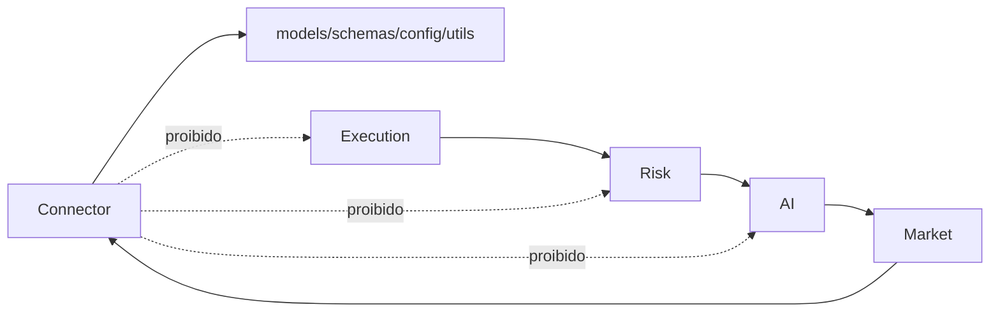

# ADR 0001: Connector isolado

## Status

Aceita.

## Contexto

O J.A.R.V.I.S AI Trader precisa integrar com plataformas externas, incluindo Polarium, sem misturar autenticacao, sessao, WebSocket e parsing com IA, risco ou execucao. Conectores mudam por motivos externos: protocolo, autorizacao, payload, endpoint, cookie, token, WebSocket e regras do provedor.

Se o Connector conhecer AI, Risk ou Execution, qualquer mudanca externa pode contaminar o nucleo operacional da plataforma.

## Decisao

O Connector deve permanecer completamente isolado.

Ele pode cuidar de:

- OAuth
- PKCE
- login
- sessao
- WebSocket
- parser
- diagnosticos tecnicos do conector

Ele nao pode cuidar de:

- score
- ranking
- decisao de trade
- gerenciamento da banca
- AutoTrade Gate
- execucao de ordem

## Consequencias

- Integracoes externas podem evoluir sem reescrever AI, Risk ou Execution.
- O sistema reduz risco de vazamento de credenciais para camadas que nao precisam delas.
- Testes de conector ficam separados de testes de decisao operacional.
- Diagnostics pode observar o conector, mas nao vira parte obrigatoria do fluxo de operacao.

## Regra de dependencia

