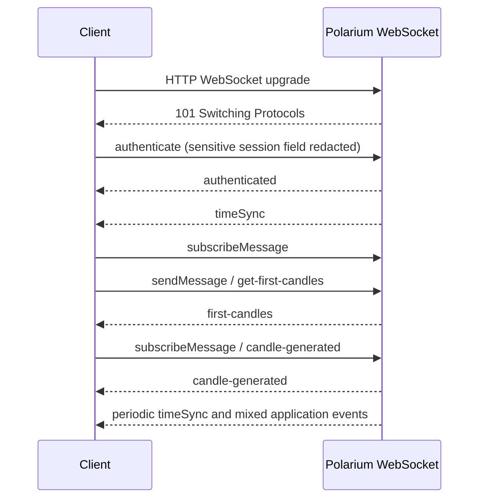
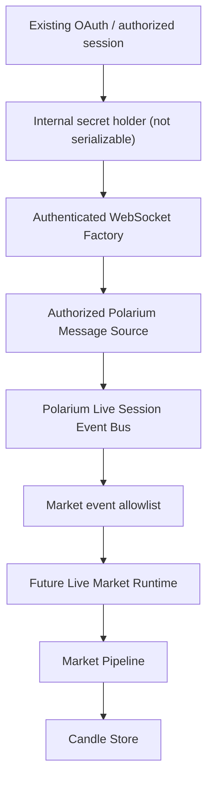

# Polarium WebSocket Handshake Evidence Sanitized

Sprint: V3.8C - Verified WebSocket Handshake Evidence

Status: sanitized technical evidence

## Scope

This document records the observed Polarium WebSocket sequence using only the authorized HAR stored locally at:

`/.jarvis_cache/evidence/trade.polariumbroker.com.har`

The raw HAR was not moved, copied to documentation, or added to Git. Sensitive request material such as cookies, tokens, Authorization, bearer values, SSID values, credentials, and private headers is intentionally omitted.

## Evidence Source

- WebSocket entries found: 1
- WebSocket messages analyzed: 3348
- HTTP upgrade status observed: 101
- Sanitized WebSocket URL: `wss://ws.trade.polariumbroker.com/echo/websocket`

## Confirmed Sequence

## Event Evidence

| Step | Direction | Evidence | Classification | Notes |
| --- | --- | --- | --- | --- |
| WebSocket URL | Client to server | `wss://ws.trade.polariumbroker.com/echo/websocket` | CONFIRMED | URL path and 101 status observed. Private headers are not documented. |
| Handshake | Client to server | HTTP GET upgrade with status 101 | CONFIRMED | Header values were intentionally not reproduced. |
| authenticate | Client to server | Top-level event `authenticate` | CONFIRMED | Structural fields observed: `local_time`, `msg`, `name`, `request_id`. A sensitive session field under `msg` was redacted. |
| authenticated | Server to client | Top-level event `authenticated` | CONFIRMED | Structural fields observed: `client_session_id`, `msg`, `name`, `request_id`. |
| timeSync | Server to client | Top-level event `timeSync` | CONFIRMED | Repeated throughout the capture. |
| heartbeat | Server/client | No explicit `heartbeat` event name observed | PARTIAL | `timeSync` is periodic, but an explicit heartbeat contract was not confirmed. |
| subscribeMessage | Client to server | Top-level event `subscribeMessage` | CONFIRMED | Used for multiple channels, including later market subscriptions. |
| get-first-candles | Client to server | `sendMessage` with inner name `get-first-candles` | CONFIRMED | Body contained market request structure such as `active_id` and `split_normalization`. |
| first-candles | Server to client | Top-level event `first-candles` | CONFIRMED | Response contains `msg.candles_by_size`. |
| candle-generated subscription | Client to server | `subscribeMessage` with inner name `candle-generated` | CONFIRMED | Parameters include routing filters with `active_id` and `size`. |
| candle-generated | Server to client | Top-level event `candle-generated` | CONFIRMED | Real-time candle updates observed after subscription. |
| candles-generated | Server to client | Top-level event `candles-generated` | PARTIAL | Observed, but not yet contracted for the runtime. |
| unsubscribeMessage | Client to server | Top-level event `unsubscribeMessage` | CONFIRMED | Observed for market channels, but not enough to define shutdown lifecycle. |
| close / encerramento | Server/client | No close frame documented in captured messages | NOT CONFIRMED | The capture ended with unrelated application events. |

## Market Payload Fields

### first-candles

Confirmed structural location:

- `msg.candles_by_size`

Observed size keys include multiple raw sizes, including `60`.

Observed candle fields:

- `id`
- `from`
- `to`
- `open`
- `close`
- `min`
- `max`
- `volume`

### candle-generated

Observed fields:

- `active_id`
- `size`
- `id`
- `from`
- `to`
- `open`
- `close`
- `min`
- `max`
- `min_at`
- `max_at`
- `at`
- `ask`
- `bid`
- `phase`
- `volume`

No symbol, visual timeframe label, spread, signal, indicator, probability, or execution decision is confirmed by this event.

## Non-Market Events

The same WebSocket stream also contains application and account-related events, including balance, order, position, portfolio, profile, result, and currency update events. These events must not be routed into the Market Pipeline.

Future live-market processing must use an allowlist and accept only market data events that have validated contracts.

## Factory and Message Source Decision

The evidence confirms that authenticated WebSocket access depends on a secret-bearing session field during the `authenticate` step. That field was redacted and must not be accepted, logged, copied, or exposed by any public endpoint.

An `AuthenticatedWebSocketFactory` is therefore not safe to implement directly from the HAR evidence alone. A future implementation needs a controlled internal abstraction that:

- owns secret-bearing session material in one isolated layer;
- never returns raw tokens, cookies, SSID values, Authorization headers, or bearer values;
- never logs or serializes private headers;
- returns only an already-authenticated decoded message stream to the Message Source.

The `AuthorizedPolariumMessageSource` should consume an already-authenticated stream or a safe factory interface. It should not read raw secrets, duplicate OAuth, invent WebSocket protocol behavior, or connect directly to the Market Pipeline.

## Recommended Secure Architecture

The architecture remains blocked until the safe factory/secret-holder boundary exists. Until then, only sanitized evidence and development-only runtime feeds should be used.

## Conclusions

- WebSocket URL: CONFIRMED.
- HTTP upgrade handshake: CONFIRMED.
- `authenticate`: CONFIRMED, with sensitive session field redacted.
- `authenticated`: CONFIRMED.
- `timeSync`: CONFIRMED.
- explicit heartbeat: PARTIAL.
- `subscribeMessage`: CONFIRMED.
- `get-first-candles`: CONFIRMED.
- `first-candles`: CONFIRMED.
- `candle-generated`: CONFIRMED.
- close/encerramento: NOT CONFIRMED.
- safe production Message Source: BLOCKED until a secret-safe authenticated stream abstraction exists.
